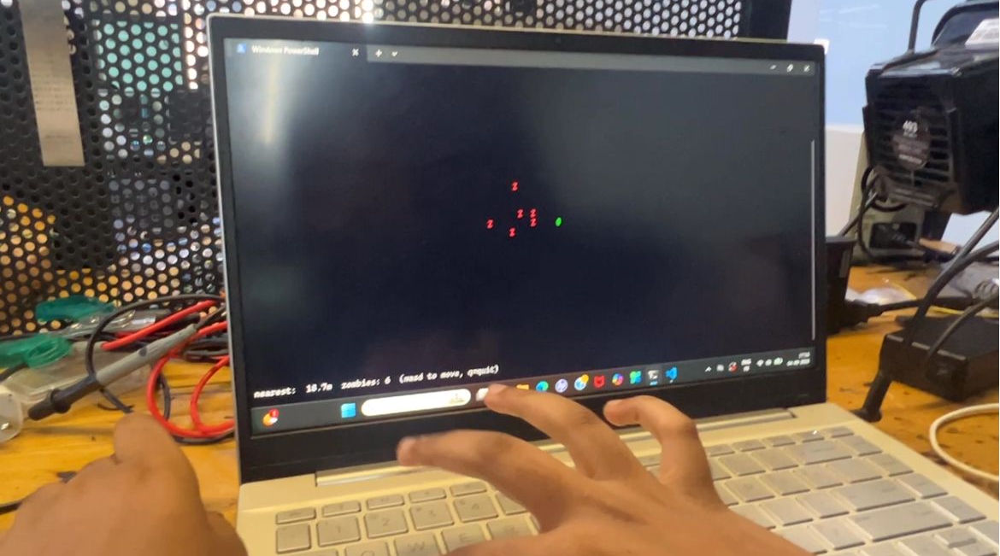
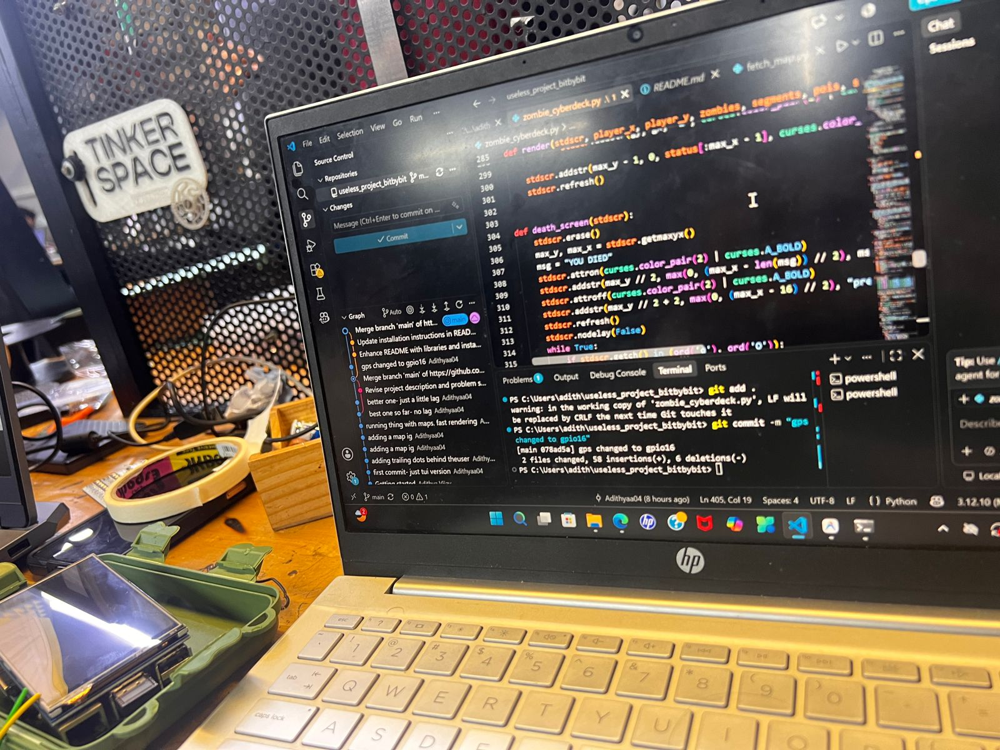
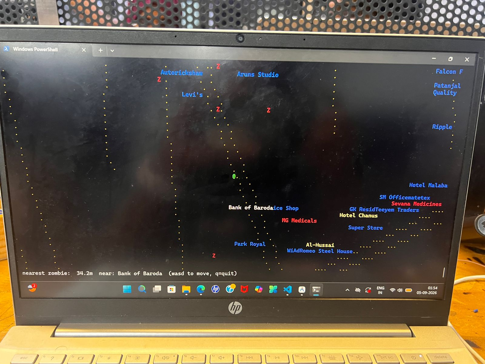
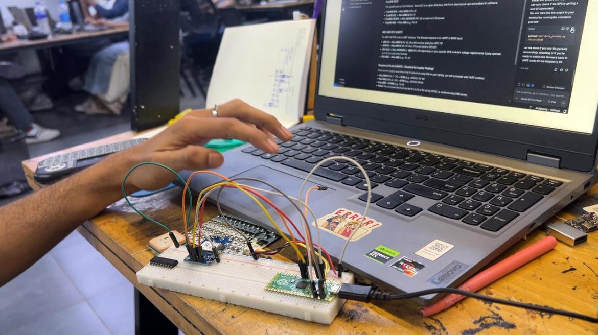
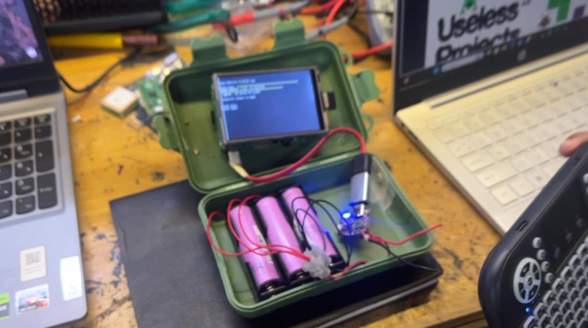
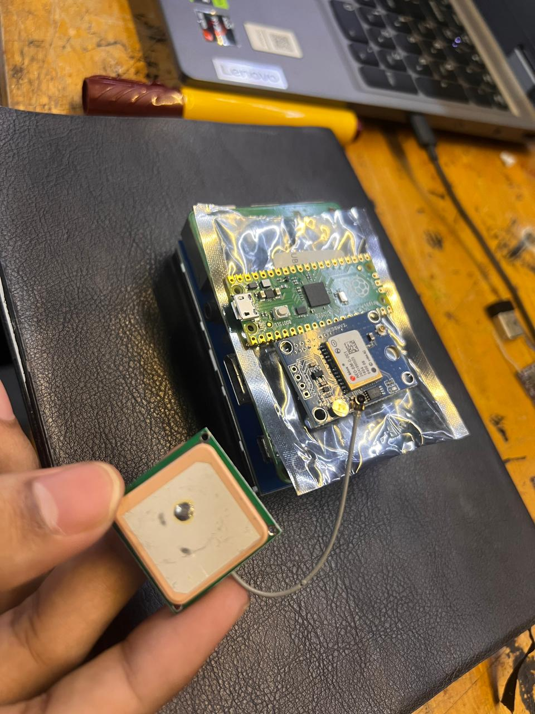
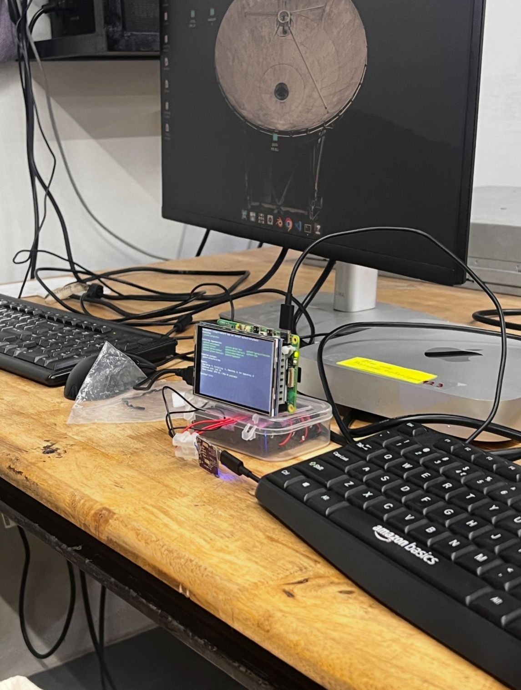
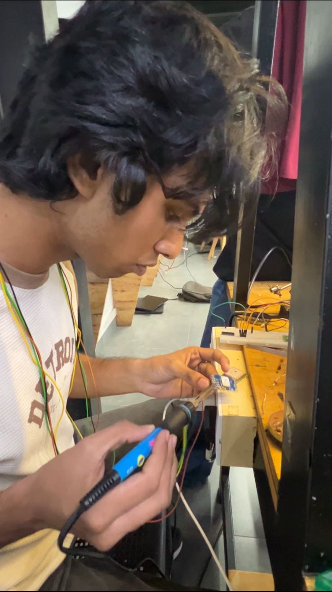
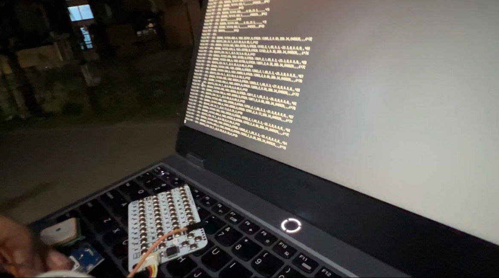
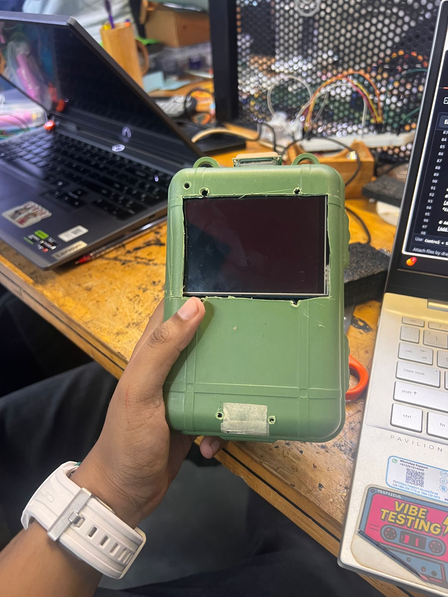

# Zombie Deck 🎯

## Basic Details
### Team Name: [Bit By Bit]

### Team Members
- Member 1: Abhijith R - NSS College Of Engineering Palakkad
- Member 2: Adithya Vijay - NSS College Of Engineering Palakkad

### Project Description
A hardware-based zombie chase game that runs on a handheld Raspberry Pi terminal. Run for your life as zombies chase you!!

### The Problem (that doesn't exist)
Zombie apocalypses are real. Ofcourse EVERYBODY need to outrun the undead through their own neighborhood on a Tuesday evening. Humanity remains criminally under-equipped to know exactly how close a horde of zombies currently is, in meters, while jogging past the local chaya kada.

### The Solution (that nobody asked for)
We made a hand-held Cyber Deck using Raspberry Pi, and since your street is a live zombie-infested map, and you are the controller. No joystick, no WASD, you outrun the zombies by, well, outrunning them.

### How to run the cyberdeck

- In the hardware cyberdeck, this entire process is automated
- the latitude and longitude extracted from your current location and a map (in ascii cuz its cool) loaded into the tft display
- basically just turn on your cyber deck, you'll see your locality (yes chaya kada and all) and just start running as you see zombies approach 

## Technical Details
### Technologies/Components Used
For Software:
- curses (terminal rendering engine for the TFT display)
- argparse, json, math, random, threading (standard library)
- pynmea2 (parses NMEA GPS sentences)
- pyserial (reads the GPS module over UART)
- OpenStreetMap Overpass API (source of real road + point-of-interest data)

For Hardware:
- Raspberry Pi 3 (Model B/B+) — running Debian, headless console mode
- 3.5" TFT display — acts as the game screen, connected via SPI (using the Pi's GPIO header) or HDMI depending on model
- NEO-6M GPS module — provides live position when running in wired mode
- Portable power bank (5V USB) — for untethered outdoor use
- Jumper wires (female-to-female, for GPIO connections)
- MicroSD card (8GB+) — for the Debian OS
- NEO-6M GPS: UART/NMEA 0183 output, 9600 baud default, 3.3–5V logic tolerant, external ceramic patch antenna
- Wiring used: GPS GND → Pi physical pin 34, GPS TX → Pi physical pin 36 (GPIO16, bit-banged serial via pigpio), GPS VCC → Pi 3.3V/5V rail — chosen because pins 8/10 (the hardware UART) were already occupied by the TFT
- Power bank: 5V/2A+ output recommended for stable Pi 3 operation under load

### Implementation
For Software:
# Installation
- pip install pynmea2 pyserial --break-system-packages

# Run
- python3 fetch_map1.py --lat <your-lat> --lon <your-lon> --radius 300
- python3 zombie_cyberdeck.py --sim
- python3 zombie_cyberdeck.py --gps /dev/rfcomm0 --baud 9600

### Project Documentation
For Software:

# Screenshots (Add at least 3)
![Screenshot1]

First prototype for the application. just a human (green dot) and zombies(red) in a black background, and they can interact with eachother

![Screenshot2]

LOC, integrating OpenStreetMap, pynmea2 pyserial and other modules necessary for the functioning

![Screenshot3]

Better output model, which can show the names of establishments and help the human to shelter

For Hardware:

# Schematic & Circuit
![Circuit]

![Schematic]

# Build Photos
![Components]

### Project Demo
# Video
[[Add your demo video link here](https://drive.google.com/file/d/1eoE_j6qld39hfe-Od8CWFa1EvSzYB2Pg/view?usp=drivesdk)]

---
Made with ❤️ at TinkerHub Useless Projects 

