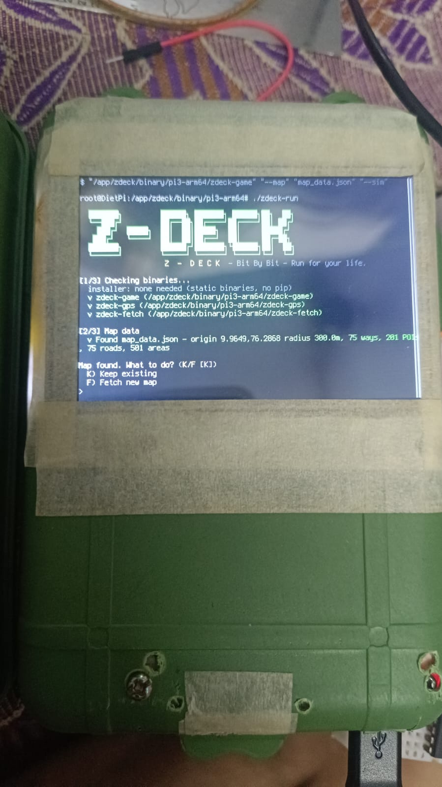

# Zombie Deck 🧟

A hardware-based zombie chase game on a handheld Raspberry Pi terminal. Your street is a live zombie-infested map — and **you** are the controller. No joystick, no WASD (unless you're indoors testing). You outrun zombies by *actually outrunning them*.

## Basic Details

### Team Name: Bit By Bit

### Team Members
- Member 1: Abhijith R — NSS College Of Engineering Palakkad
- Member 2: Adithya Vijay — NSS College Of Engineering Palakkad

### Project Description
A hardware-based zombie chase simulation that runs on a handheld Raspberry Pi terminal. The system transforms your immediate surroundings into a live survival environment, where the objective is deceptively simple: keep moving, or get eaten. It renders your real neighbourhood (roads + POIs from OpenStreetMap) as ASCII on a 3.5" TFT, spawns zombies around you using live GPS, and they chase you. Run for your life.

### The Problem (that doesn't exist)
Zombie apocalypses are real. Obviously EVERYBODY needs to outrun the undead through their own neighborhood on a Tuesday evening. Modern society has invested heavily in navigation, fitness tracking, and emergency communication, yet somehow overlooked one critical metric: how close is the nearest zombie, in meters, while jogging past the local chaya kada?

During an unexpected zombie outbreak, civilians would have no reliable method to quantify undead pursuit distance while navigating their local surroundings. This is particularly concerning on an otherwise completely normal Tuesday evening.

### The Solution (that nobody asked for)
A handheld Raspberry Pi-powered Cyber Deck that turns the real world into a live zombie survival simulation.

You become the controller, while your street becomes the map. No joystick, no WASD (unless you're indoors testing), no convenient pause button — you outrun the zombies by, well, outrunning them. Turn it on, it loads your locality (yes, chaya kada and all) onto the TFT, tracks your movement, and drops zombies on the map — effectively converting a casual evening jog into a low-budget, unnecessarily sophisticated survival experiment.

---

## Repository Structure

```
.
├── run.py                 # master entry point: checks, setup, launch (recommended)
├── app/
│   ├── cyberdeck.py       # Python game (curses) — canonical
│   ├── zombie_cyberdeck.py# legacy duplicate of cyberdeck.py
│   ├── fetch_map.py       # map fetcher (stdlib only) — canonical
│   ├── fetch_map1.py      # legacy duplicate of fetch_map.py
│   ├── run.py             # Python-only launcher (install deps, fetch map, launch)
│   └── map_data.json      # pre-fetched OSM map (generated)
├── rust/                  # Rust port (ratatui/crossterm): zdeck-game/gps/fetch/run/cardkb
│   ├── src/bin/           # zdeck-game.rs, zdeck-gps.rs, zdeck-fetch.rs, zdeck-run.rs, zdeck-cardkb.rs
│   └── build-pi.sh        # Docker cross-compile for Pi 3
├── binary/
│   ├── pi3-arm64/         # prebuilt 64-bit Pi binaries
│   └── pi3-armv7/         # prebuilt 32-bit Pi binaries
├── os/pi3-arm64/          # deck scripts: zdeck-main.sh, zdeck-auto.sh, install-autostart.sh
├── cardkb/                # M5Stack CardKB I2C keyboard driver + setup.sh + diag.sh
├── assets/images/         # screenshots, schematics, build photos
└── index.html
```

> Note: `app/zombie_cyberdeck.py` and `app/fetch_map1.py` are byte-identical legacy copies kept for backwards compatibility. Use `app/cyberdeck.py` and `app/fetch_map.py`.

---

## How It Works

1. **Fetch once (with internet):** `fetch_map.py` downloads roads/POIs around your lat/lon from the OpenStreetMap Overpass API and saves `app/map_data.json`.
2. **Play offline (in the field):** `cyberdeck.py` (or the Rust `zdeck-run`) loads that file, reads live NMEA GPS, and renders an ASCII map with you + chasing zombies on the TFT terminal.
3. **Move = GPS.** Outdoors your body is the joystick. Indoors use `--sim` (WASD) testing mode.

---

## Technical Details

### Software

| Part | Stack |
|---|---|
| Python game | `curses` (terminal rendering), `argparse`, `json`, `math`, `random`, `threading` |
| GPS input | `pynmea2` (NMEA parsing), `pyserial` (UART serial), `pigpio` (GPIO bit-bang, only for `--gpio` mode) |
| Map data | OpenStreetMap Overpass API (`fetch_map.py` uses stdlib only — nothing to install) |
| Rust port | `ratatui` + `crossterm` (TUI), `clap`, `serde/serde_json`, `ureq`, `evdev` + `i2cdev` (CardKB) |
| Deck glue | `os/pi3-arm64/zdeck-main.sh`, `zdeck-auto.sh`, `install-autostart.sh`; `cardkb/setup.sh`, `cardkb/diag.sh` |

### Hardware

- Raspberry Pi 3 (Model B/B+) — Debian, headless console mode
- 3.5" TFT display — game screen over SPI (GPIO header) or HDMI depending on model
- NEO-6M GPS module — NMEA 0183 over UART, 9600 baud default, 3.3–5V tolerant, ceramic patch antenna
- M5Stack CardKB (I2C `0x5F`) — mini keyboard exposed as a virtual keyboard via `uinput` (Rust `zdeck-cardkb` driver)
- Portable 5V/2A+ USB power bank, MicroSD 8GB+, female-to-female jumpers

### Wiring

| Connection | Pins |
|---|---|
| GPS GND → Pi | physical pin 34 (GND) |
| GPS TX → Pi | physical pin 36 (GPIO16, pigpio bit-bang serial) — pins 8/10 (hardware UART) are occupied by the TFT |
| GPS VCC → Pi | 3.3V / 5V rail |
| CardKB VCC / GND / SDA / SCL | 3.3V / GND / GPIO2 (SDA) / GPIO3 (SCL) |

---

## Installation & Running

### 0. Easiest path — master script (recommended)

```bash
python3 run.py            # interactive master menu: checks, setup, launch
python3 run.py --check   # verify only, change nothing
python3 run.py --sim     # checks, then straight into Rust SIM
python3 run.py --setup   # setup flows only, no launch
```

It checks repo files, Pi binaries, Python deps, I2C/GPS/uinput hardware, and offers to install/fix what's missing before launching.

### 1. Python quickstart (any laptop or Pi)

```bash
# GPS deps only needed for real-GPS mode (sim + fetch need nothing extra)
pip install pynmea2 pyserial --break-system-packages
# bit-bang GPIO mode additionally needs:
pip install pigpio --break-system-packages   # + sudo systemctl start pigpiod
```

```bash
# Fetch a map ONCE (needs internet):
python3 app/fetch_map.py --lat <your-lat> --lon <your-lon> --radius 300
#   --out defaults to map_data.json; find lat/lon via openstreetmap.org

# Play in SIM mode (WASD to move, Q to quit):
python3 app/cyberdeck.py --sim
python3 app/cyberdeck.py --sim --map app/map_data.json

# Play with a serial GPS puck / bluetooth GPS:
python3 app/cyberdeck.py --gps /dev/ttyAMA0 --baud 9600
python3 app/cyberdeck.py --gps /dev/rfcomm0 --baud 9600

# Play with NEO-6M bit-banged on GPIO16 (TFT occupies hardware UART):
python3 app/cyberdeck.py --gpio 16 --baud 9600
```

Python-only launcher alternative:

```bash
python3 app/run.py              # interactive
python3 app/run.py --sim
python3 app/run.py --gps /dev/rfcomm0 --baud 9600
python3 app/run.py --gpio 16 --baud 9600
```

### 2. Rust path (faster TUI, same game)

```bash
cargo run --quiet --bin zdeck-run -- --sim        # dev-machine SIM test
cargo build --bins                                 # builds zdeck-*

# Fetch + play with native binaries:
./rust/target/debug/zdeck-fetch --lat 10.0261 --lon 76.3125 --radius 300
./rust/target/debug/zdeck-run --sim
```

Cross-compile for the Pi (needs docker or podman):

```bash
./rust/build-pi.sh          # both armv7 + arm64
./rust/build-pi.sh arm64    # 64-bit Pi OS only
./rust/build-pi.sh armv7    # 32-bit Pi OS only
# output: binary/pi3-arm64/* and binary/pi3-armv7/*
```

On the Pi:

```bash
scp binary/pi3-arm64/* pi@raspberrypi:~/zdeck/
ssh pi@raspberrypi
chmod +x ~/zdeck/*
~/zdeck/zdeck-fetch --lat 10.0261 --lon 76.3125 --radius 300
~/zdeck/zdeck-run --sim
```

### 3. On-deck setup (Pi)

```bash
sudo bash cardkb/setup.sh                 # I2C + uinput + cardkb.service (reboots if needed)
bash os/pi3-arm64/install-autostart.sh --yes   # tty1 login hook -> zdeck-main.sh (boot-to-game)
~/zdeck/zdeck-main.sh --sim               # deck loop test
sudo bash cardkb/diag.sh                  # CardKB not typing? full report + likely cause
sudo bash cardkb/diag.sh --live           # + 10 s live keypress test
```

See [`cardkb/README.md`](cardkb/README.md) and [`binary/README.md`](binary/README.md) for full details.

### Controls

| Mode | Controls |
|---|---|
| `--sim` | `WASD` / arrows to move, `Q` to quit |
| GPS modes | walk — your position is the joystick |

Game tuning lives at the top of `app/cyberdeck.py` (`SCALE_M_PER_CELL`, `ZOMBIE_COUNT`, `ZOMBIE_SPEED_MPS`, `CATCH_RADIUS_M`, `TICK_HZ`, spawn radii).

---

## Project Documentation

### Screenshots


First prototype — just a human (green dot) and zombies (red) on black. They chase, they catch.


LOC — integrating OpenStreetMap roads + POIs with `pynmea2`/`pyserial` for live play.


Better output model — named establishments drawn on the map so you can run toward shelter.

### Hardware

#### Schematic & Circuit


#### Build Photos




### Project Demo

#### Video
[Demo video](https://drive.google.com/file/d/12bjlr13PvpbS4DbJXnQ3hlKXM0N1LKDT/view?usp=sharing)

---

## Troubleshooting

| Symptom | Fix |
|---|---|
| No map / empty roads | re-run `fetch_map.py` with internet; check `app/map_data.json` exists |
| GPS garbage / no fix | 9600 baud default; take the NEO-6M outdoors; check port (`/dev/ttyAMA0`, `/dev/ttyUSB0`, `/dev/rfcomm0`) |
| `pigpio` errors in `--gpio` mode | `sudo systemctl start pigpiod` |
| CardKB not on bus | `sudo i2cdetect -y 1` should show `5F`; check VCC→3.3V, SDA→GPIO2, SCL→GPIO3 |
| CardKB silent | `sudo bash cardkb/diag.sh` — fixes group/uinput/service issues |

---

Made with ❤️ at TinkerHub Useless Projects


